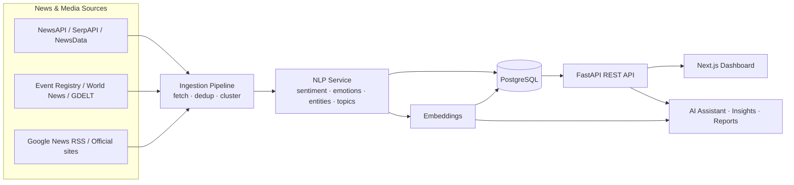

<div align="center">

# SentiNews

### AI-powered media monitoring & sentiment analysis for news in English, Russian and Kazakh

[](https://fastapi.tiangolo.com/)
[](https://nextjs.org/)
[](https://www.postgresql.org/)
[](https://openai.com/)
[](#license)

A Brand24-style platform that automatically collects public news from dozens of sources,
classifies topics, scores sentiment and emotions, and turns it all into live dashboards,
AI insights and exportable reports.

</div>

---

## Overview

**SentiNews** is a full-stack media-monitoring web platform built as a Bachelor's diploma
project at **Astana IT University**. You create a project around a brand or topic, and the
system continuously gathers public news mentions in **English, Russian and Kazakh**, then
analyses them to answer questions like: _How many people are talking about us? Is the
sentiment positive or negative? Which outlets and regions drive the conversation? What
changed this week?_

It combines a classic data-ingestion pipeline with modern NLP (OpenAI GPT models for
sentiment/emotion, embeddings for retrieval-augmented chat) and a polished, fully
internationalised UI.

## Key Features

- **Topic & brand projects** — create, edit, delete, and compare against competitors.
- **Multilingual ingestion** — NewsAPI, SerpAPI (Google News), NewsData.io, Event Registry,
  World News API, GDELT, Google News RSS and direct official-site crawling.
- **Deduplication** — URL / title / normalized-text hashing + clustering so each story is
  counted once.
- **Sentiment & emotion** — GPT-based sentiment plus an 8-emotion (Plutchik) breakdown.
- **Analytics** — total mentions, social/non-social reach, sentiment split, geography,
  languages, top sources, influencers, hot hours and anomaly detection.
- **AI assistant (RAG)** — chat grounded in the project's real mentions via persistent
  embeddings, plus auto-generated insights and structured AI reports.
- **Reports** — premium PDF, Excel, scheduled Email and shareable Infographic exports
  (with Cyrillic / Kazakh font support).
- **Full i18n** — every screen available in English, Russian and Kazakh.
- **Auth** — email/password with verification, JWT sessions, and Google OAuth.

## Architecture



## Tech Stack

| Layer        | Technologies |
|--------------|--------------|
| **Frontend** | Next.js 16 (App Router), React 19, TypeScript, Tailwind CSS v4, Radix UI, Framer Motion, TanStack Query, Zustand, ECharts, i18next |
| **Backend**  | FastAPI, SQLAlchemy 2.0 (async), Alembic, Pydantic v2, JWT, bcrypt |
| **Data / AI**| PostgreSQL, OpenAI (GPT-4o / GPT-4o-mini / text-embedding-3-small), httpx, feedparser, BeautifulSoup |
| **Infra**    | Docker, Render (API + Postgres), Vercel (frontend) |

## Project Structure

```
DiplomaProject/
├── backend/            # FastAPI application
│   ├── app/
│   │   ├── api/        # REST routes
│   │   ├── models/     # SQLAlchemy models
│   │   ├── schemas/    # Pydantic schemas
│   │   ├── services/   # Ingestion, NLP, analytics, AI, reports …
│   │   └── tasks/      # Scheduling & background dispatch
│   └── alembic/        # Database migrations
├── frontend/           # Next.js dashboard
│   └── src/
│       ├── app/        # Routes (auth, dashboard, legal)
│       ├── features/   # Feature modules (analysis, mentions, reports …)
│       ├── components/ # Shared UI
│       └── lib/        # API client, i18n, utilities
├── render.yaml         # One-click Render blueprint
└── DEPLOY.md           # Step-by-step deployment guide
```

## Getting Started

### Prerequisites
- Python 3.12+
- Node.js 20+
- PostgreSQL 15+
- An OpenAI API key (and optionally news-provider keys)

### 1. Backend

```bash
cd backend
python -m venv .venv
.venv\Scripts\activate          # Windows  (use: source .venv/bin/activate on macOS/Linux)
pip install -r requirements.txt

cp .env.example .env            # then fill in DATABASE_URL, OPENAI_API_KEY, etc.
alembic upgrade head            # apply migrations
uvicorn app.main:app --reload   # http://localhost:8000  (docs at /docs)
```

### 2. Frontend

```bash
cd frontend
npm install
cp .env.example .env.local      # set NEXT_PUBLIC_API_URL, NEXT_PUBLIC_GOOGLE_CLIENT_ID
npm run dev                     # http://localhost:3000
```

## Deployment

A complete A-to-Z guide for deploying to a custom domain (Render for the API + Postgres,
Vercel for the frontend) lives in **[DEPLOY.md](./DEPLOY.md)**. The repository also ships a
`render.yaml` blueprint and a backend `Dockerfile`.

## Authors

- **Nurasyl Kairkhanov** — backend, data ingestion & AI
- **Akezhan Meirkhanov** — frontend, analytics & UX

Astana IT University · Bachelor's diploma project.
Contact: [nurasylkairkhanov@gmail.com](mailto:nurasylkairkhanov@gmail.com)

## License

This is an academic project intended for educational and research purposes. All third-party
news content remains the property of its original publishers; SentiNews stores only short
excerpts and links back to the source.
